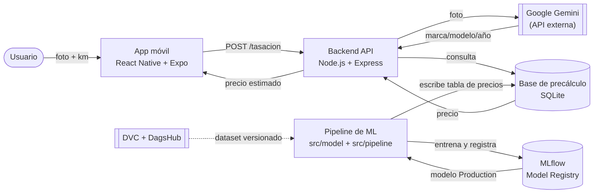

# ValorAuto

Tasador de Autos con IA — sube una foto y el kilometraje de un auto y obtén su precio de mercado al instante.

**Curso:** Taller de Sistemas Inteligentes — LAB_01 (SIS-352)
**Caso elegido:** ver [`docs/priorizacion_casos.md`](docs/priorizacion_casos.md)
**Estado actual:** Sprint 1 (Datos) en curso. Línea base del modelo ya entrenada y registrada (ver [Evidencia de línea base](docs/evidence/baseline-modelo.md)).

## Sobre el proyecto

**Problema:** tasar un auto usado en Bolivia hoy depende de buscar manualmente en catálogos/clasificados, sin una referencia rápida y confiable de precio.

**Product Goal:** para un usuario que quiere vender o comprar un auto usado en Bolivia, el Tasador de Autos IA es una app móvil que identifica el vehículo a partir de una foto (marca, modelo, año) y, junto con el kilometraje ingresado, entrega un precio de mercado precalculado cada madrugada — sin cómputo de ML en el momento de la consulta. Detalle completo del objetivo, alcance y backlog en [`docs/contexto/contexto_proyecto.md`](docs/contexto/contexto_proyecto.md).

**Equipo:** Marvin Mollo Ramírez, Leonardo Delgado, Samuel Villca — Taller de Sistemas Inteligentes (SIS-352), UCB.

**Resultados actuales de la línea base** (corrida real de punta a punta, `docs/evidence/baseline-modelo.md`):

| Modelo | RMSE | MAE | R² |
|---|---|---|---|
| Linear Regression (baseline) | 8107.91 | 5587.19 | 0.6716 |
| Random Forest | 7048.09 | 4566.73 | 0.7518 |
| **XGBoost (Production)** | **6085.26** | **3777.90** | **0.8150** |

Entrenado sobre 352,005 filas limpias del Craigslist Vehicles Dataset. La tabla de precios precalculada tiene 78,915 combinaciones (marca/modelo/año/rango de km), con una latencia de consulta de ~0.24ms promedio.

**Metodología:** el proyecto sigue CRISP-ML(Q); ver el mapeo completo de fases a la estructura del repo en [`docs/crisp-mlq.md`](docs/crisp-mlq.md).

## Stack decidido

| Capa | Tecnología | ADR |
|---|---|---|
| App móvil | React Native + Expo | [ADR-0002](docs/adr/0002-frontend-react-native-expo.md) |
| Backend | Node.js + Express | [ADR-0001](docs/adr/0001-backend-nodejs-express.md) |
| Visión | Google Gemini API | [ADR-0004](docs/adr/0004-gemini-vision-vs-modelo-propio.md) |
| Modelo de precio | Scikit-Learn / XGBoost | [Evidencia de línea base](docs/evidence/baseline-modelo.md) |
| Tracking / Registry | MLflow | [ADR-0005](docs/adr/0005-mlflow-tracking-model-registry.md) |
| Precálculo (lectura rápida) | SQLite | [ADR-0007](docs/adr/0007-sqlite-lectura-rapida.md) |
| Orquestación nocturna | cron / Airflow | [ADR-0003](docs/adr/0003-precalculo-nocturno-vs-tiempo-real.md) |
| Versionamiento de datos | DVC + DagsHub | [ADR-0006](docs/adr/0006-dvc-dagshub-versionamiento-datos.md) |

## Arquitectura

Vista simplificada del sistema (diagramas C4 completos en [`docs/architecture/C4-ValorAuto.md`](docs/architecture/C4-ValorAuto.md)):



El flujo de arriba (tasación en vivo) corre en milisegundos porque solo lee de la base de precálculo; el flujo de abajo (pipeline nocturno) es el que reentrena el modelo y regenera esa tabla.

## Estructura

- [`docs/`](docs/) — documentación de equipo, arquitectura, ADRs, riesgos y evidencias.
- [`data/`](data/) — datasets crudos y procesados (ver [`data/README.md`](data/README.md) para el estado de versionamiento).
- [`src/`](src/) — componentes reutilizables: modelo de precio (`model/`, con `eda/` separado por tipo de exploración), precálculo nocturno (`pipeline/`), visión (`vision/`), API (`api/`), gráficos generados (`graphics/`). Ver [`src/README.md`](src/README.md).
- [`notebooks/`](notebooks/) — notebooks delgados que orquestan las funciones de `src/` (`01_eda.ipynb`, `02_entrenamiento.ipynb`, `03_precalculo.ipynb`). Ver [ADR-0008](docs/adr/0008-separacion-componentes-notebooks-delgados.md).
- [`app/`](app/) — app móvil (React Native + Expo). Ver [`app/README.md`](app/README.md).
- [`openspec/`](openspec/) — specs versionadas de features (ej. `endpoint-tasacion-mvp`).

## Documentación

- [`docs/team_charter.md`](docs/team_charter.md) — equipo, canales, reglas de PR e integridad.
- [`docs/priorizacion_casos.md`](docs/priorizacion_casos.md) — matriz de priorización de casos y justificación del Caso A.
- [`docs/clickup_estructura.md`](docs/clickup_estructura.md) — estructura de ClickUp (listas, campos obligatorios, ejemplos de tarea).
- [`docs/contexto/contexto_proyecto.md`](docs/contexto/contexto_proyecto.md) — Product Goal, calendario de sprints y backlog completo (22 historias de usuario).
- [`docs/architecture/C4-ValorAuto.md`](docs/architecture/C4-ValorAuto.md) — diagramas C4 (contexto y contenedores) del sistema.
- [`docs/architecture/secuencia-tasacion.md`](docs/architecture/secuencia-tasacion.md) — diagrama de secuencia de los dos flujos (tasación en vivo y pipeline nocturno).
- [`docs/adr/`](docs/adr/) — Architecture Decision Records de cada elección de stack.
- [`docs/crisp-mlq.md`](docs/crisp-mlq.md) — mapeo de las fases de CRISP-ML(Q) a la estructura del repo.
- [`docs/risk-register.md`](docs/risk-register.md) — riesgos técnicos, de datos, de IA y operacionales, priorizados.
- [`docs/uso-ia.md`](docs/uso-ia.md) — declaración de uso de IA generativa en el proyecto.
- [`docs/evidence/`](docs/evidence/) — evidencia ejecutada (línea base del modelo, laboratorio de OpenSpec).

Gestión de tareas en ClickUp: workspace **Tio Sam S.R.L**, carpeta **Tasador de Autos con IA — LAB_01 TSI**.

## Cómo reproducir el avance actual

Requiere Docker y una cuenta con acceso al remoto de DagsHub del proyecto (ver nota de acceso más abajo).

```bash
git clone https://github.com/SNARF3/ValorAuto.git
cd ValorAuto

# Dataset (versionado con DVC, ver docs/adr/0006)
pip install dvc
dvc pull data/vehicles/vehicles_clean.csv.dvc

# UI de MLflow (http://localhost:5001)
docker compose up mlflow

# Reentrena los 3 modelos (EDA -> entrenamiento -> precálculo) y regenera data/precalc.db
docker compose run --rm training
```

Ambos servicios corren sobre la misma imagen (`docker/Dockerfile`) con el repo montado como volumen: lo que el contenedor escribe (`mlflow.db`, `mlruns/`, `data/precalc.db`, `src/graphics/`) queda directamente en esta carpeta. Detalle completo en [`src/README.md`](src/README.md#alternativa-mlflow-y-el-reentrenamiento-en-docker).

**Nota de acceso a datos:** el remoto de DagsHub es `https://dagshub.com/SNARF3/ValorAutoData` (ver [ADR-0006](docs/adr/0006-dvc-dagshub-versionamiento-datos.md)). Si `dvc pull`/`dvc push` fallan con error de autenticación, configurá tu token de DagsHub localmente (nunca se commitea):

```bash
dvc remote modify origin --local auth basic
dvc remote modify origin --local user <tu-usuario-dagshub>
dvc remote modify origin --local password <tu-token-dagshub>
```

**MLflow remoto (opcional, resuelve R15):** por defecto MLflow usa el sqlite local (`mlflow.db`) dentro del contenedor y todo funciona igual. Para que las corridas (con sus artifacts) queden en el MLflow hospedado en DagsHub, copiá `.env.example` a `.env` en la raíz y completá tu usuario/token de DagsHub — ver [ADR-0005](docs/adr/0005-mlflow-tracking-model-registry.md).

`src/api` (Node.js/Express) todavía no tiene código propio más allá del scaffold (`src/api/.gitkeep`) — corresponde a Sprint 4 del [backlog](docs/contexto/contexto_proyecto.md).
