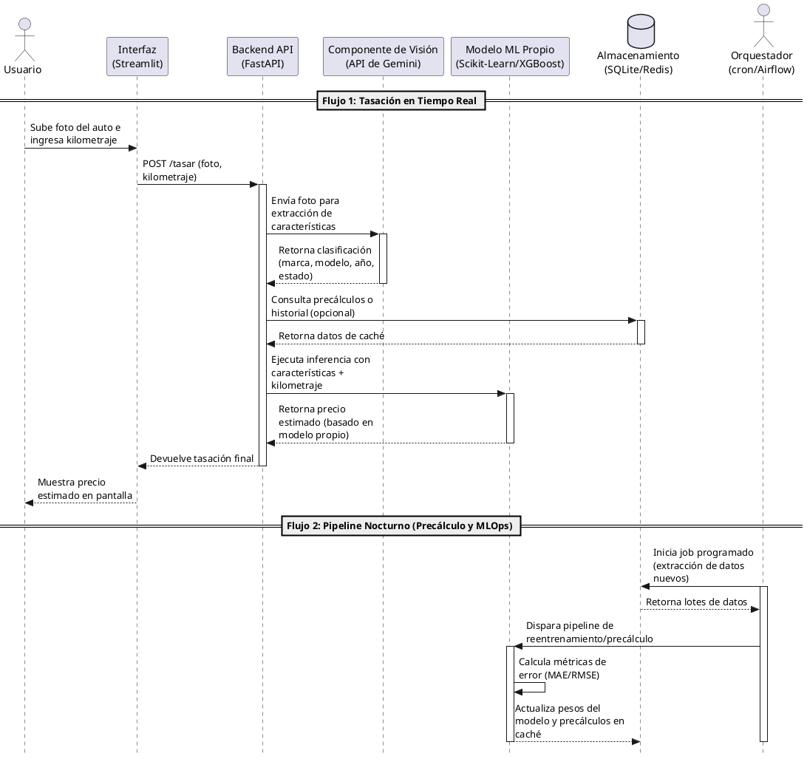

# Diagrama de Secuencia del Sistema (SSD) - Tasador de Autos con IA

Este documento detalla el Diagrama de Secuencia del Sistema para el **Caso A: Tasador de Autos con IA**, destacando la coordinación entre el servicio de inferencia en tiempo real y el proceso de precálculo/reentrenamiento nocturno.

## Código PlantUML

Puedes usar el siguiente código en cualquier renderizador de PlantUML (como PlantText o extensiones de VS Code) para visualizar el diagrama.

## Detalles del Flujo del Sistema

### 1. Tasación en Tiempo Real (Sincrónico)
* **Interacción Inicial:** El usuario interactúa con una interfaz construida en Streamlit, proporcionando los inputs requeridos: una fotografía del vehículo y su kilometraje.
* **Procesamiento de Visión:** FastAPI recibe la petición y delega la imagen a la API de Gemini, que actúa exclusivamente como clasificador visual para extraer atributos clave (marca, modelo, año).
* **Predicción del Modelo:** Una vez que FastAPI tiene los atributos visuales y el kilometraje, consulta al modelo de regresión propio (entrenado con Scikit-Learn o XGBoost sobre el dataset de Craigslist). Esta separación técnica garantiza que la predicción del precio dependa del modelo propio y no del LLM.

### 2. Precálculo y MLOps Nocturno (Asincrónico)
* **Orquestación:** Utilizando cron o Airflow, el sistema automatiza un trabajo en segundo plano para procesar datos fuera del horario pico.
* **Actualización:** Este flujo se encarga de reentrenar el modelo, calcular métricas medibles como el MAE/RMSE y guardar resultados o cachés en SQLite o Redis para agilizar las respuestas del día siguiente.
