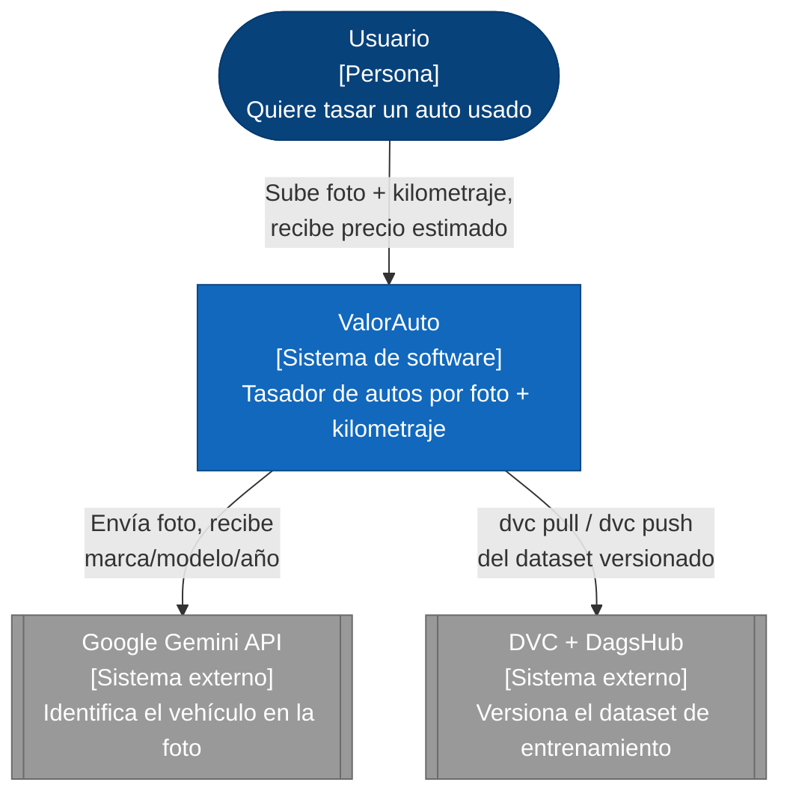
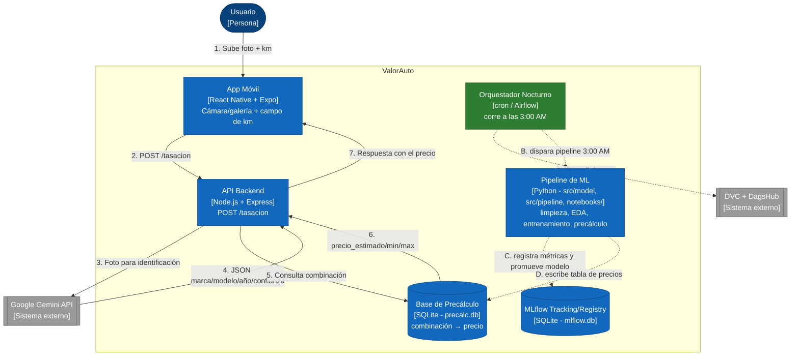

# Arquitectura C4 — ValorAuto

Diagramas C4 (Contexto y Contenedores) del Tasador de Autos con IA, alineados al stack decidido en Sprint 0 (ver ADRs en [`docs/adr/`](../adr/)): **Node.js/Express** para el backend, **React Native + Expo** para la app móvil, **MLflow** para tracking/registro de modelos y **DVC + DagsHub** para versionamiento de datos.

Fuente editable en draw.io: [`valorauto-c4-container.drawio`](valorauto-c4-container.drawio) (importar en [app.diagrams.net](https://app.diagrams.net) con "File → Open From → Device").

## Nivel 1 — Contexto del sistema

Quién usa ValorAuto y con qué sistemas externos interactúa.

## Nivel 2 — Contenedores

Cómo se divide ValorAuto por dentro, y cómo se comunican sus piezas. Incluye los dos flujos del sistema: la tasación en tiempo real (síncrona) y el pipeline de MLOps nocturno (asíncrono).

## Componentes y responsabilidad

| Componente | Tecnología | Responsabilidad |
|---|---|---|
| App Móvil | React Native + Expo | Captura de foto (cámara/galería), campo de kilometraje, botón "Tasar Auto", muestra el precio devuelto por la API. |
| API Backend | Node.js + Express | Valida entrada (imagen, km), orquesta la llamada a Gemini y la consulta a la base de precálculo. Único componente que expone contrato público (`POST /tasacion`, ver `openspec/changes/endpoint-tasacion-mvp/specs/tasacion/spec.md`). |
| Servicio de Visión | Google Gemini API (externo) | Solo identifica el vehículo (marca, modelo, año) a partir de la foto. No predice precio: esa separación es una decisión explícita (ver [ADR-0004](../adr/0004-gemini-vision-vs-modelo-propio.md)). |
| Base de Precálculo | SQLite (`data/precalc.db`) | Tabla de lectura ultrarrápida combinación → precio, poblada por el pipeline nocturno. |
| Pipeline de ML | Python (`src/model/`, `src/pipeline/`, orquestado por notebooks delgados en `notebooks/`) | Limpieza del dataset, EDA por componentes, entrenamiento/comparación de modelos (Scikit-Learn/XGBoost) y generación de combinaciones para precálculo. Ver [ADR-0008](../adr/0008-separacion-componentes-notebooks-delgados.md). |
| MLflow Tracking/Registry | SQLite (`mlflow.db`) | Registra cada experimento (métricas MAE/RMSE/R2) y promueve el mejor modelo a "Production". |
| Orquestador Nocturno | cron / Airflow | Dispara el pipeline todos los días a las 3:00 AM sin intervención manual. |
| Dataset Versionado | DVC + DagsHub | Fuente de verdad del dataset limpio (`vehicles_clean.csv`), versionado y trazable (ver [ADR-0006](../adr/0006-dvc-dagshub-versionamiento-datos.md)). |

## Decisiones que sustentan este diagrama

Cada elección de tecnología de este diagrama tiene su ADR correspondiente en [`docs/adr/`](../adr/): backend, frontend, estrategia de precálculo, componente de visión, tracking de modelos y versionamiento de datos. Los riesgos de seguridad y de IA asociados a esta arquitectura están en [`docs/risk-register.md`](../risk-register.md).
