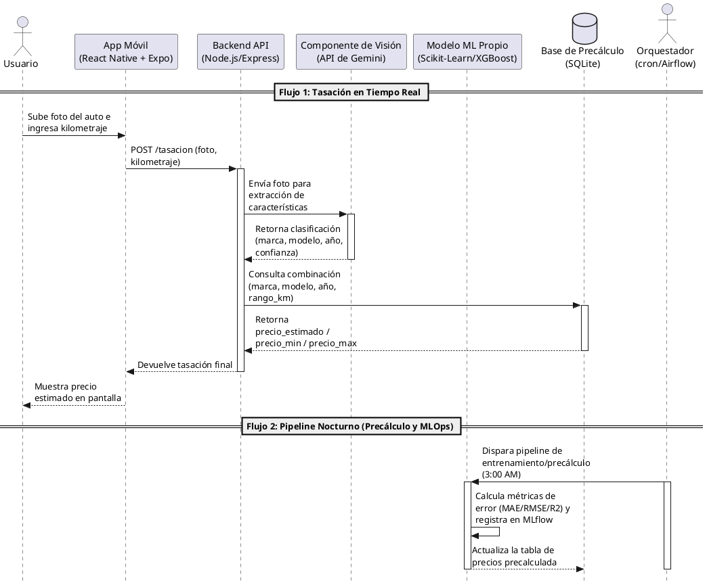

# Diagrama de Secuencia — Tasación de Autos con IA

Este documento detalla el diagrama de secuencia del **Caso A: Tasador de Autos con IA**, mostrando la coordinación entre el servicio de tasación en tiempo real y el proceso de precálculo/reentrenamiento nocturno. Para el diagrama de componentes (C4), ver [`C4-ValorAuto.md`](C4-ValorAuto.md).

> Nota: esta versión corrige el diagrama original, que todavía mencionaba Streamlit y FastAPI. El stack decidido y vigente (ver [ADR-0001](../adr/0001-backend-nodejs-express.md) y [ADR-0002](../adr/0002-frontend-react-native-expo.md)) es **React Native + Expo** para la interfaz y **Node.js/Express** para el backend.

## Código PlantUML

Puedes usar el siguiente código en cualquier renderizador de PlantUML (como PlantText o extensiones de VS Code) para visualizar el diagrama.

## Detalles del flujo del sistema

### 1. Tasación en tiempo real (síncrono)

- **Interacción inicial:** el usuario interactúa con la app móvil (React Native + Expo), proporcionando los inputs requeridos: una fotografía del vehículo y su kilometraje.
- **Procesamiento de visión:** el backend (Node.js/Express) recibe la petición y delega la imagen a la API de Gemini, que actúa exclusivamente como clasificador visual para extraer atributos clave (marca, modelo, año). Ver [ADR-0004](../adr/0004-gemini-vision-vs-modelo-propio.md).
- **Consulta de precio:** una vez que el backend tiene los atributos visuales y el kilometraje, consulta la tabla de precálculo en SQLite (no ejecuta el modelo en vivo). Ver [ADR-0003](../adr/0003-precalculo-nocturno-vs-tiempo-real.md).

### 2. Precálculo y MLOps nocturno (asíncrono)

- **Orquestación:** usando cron o Airflow, el sistema automatiza un trabajo en segundo plano para procesar datos fuera del horario pico (3:00 AM).
- **Actualización:** este flujo reentrena/compara modelos, calcula métricas medibles (MAE/RMSE/R2) registradas en MLflow (ver [ADR-0005](../adr/0005-mlflow-tracking-model-registry.md)), promueve el mejor modelo a "Production", y regenera la tabla de precios en SQLite para el día siguiente.
